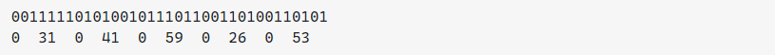
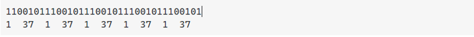
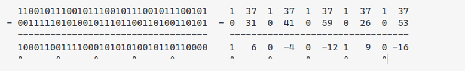
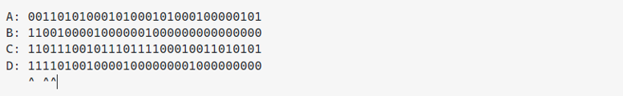

##Fusion tree
###Содержание:
[Введение](#intro)
[Зависимость железа и алгоритма](#w)
[Скетчи, маски, два бита](#scetch)
[Источники информации](#info)

###Введение
Fusion tree — дерево поиска, позволяющее хранить n w-битных чисел, используя O(n) памяти, и выполнять операции поиска за время O(logwn). Это статическая структура данных, которая была впервые предложена в 1990 году М. Фредманом (M. Fredman) и Д. Уиллардом (D. Willard).
Для того чтобы дать четкое определение что такое fusion tree и в чем его изюминка, предстоит ответить на ряд вопросов:

1.	Уменстно ли использовать fusion tree как структуру для сортировки 32 или 64 битных чисел, или она было придуманна для хранения данных с более длинным наборов битов?
2.	В чем заключаются отличия fusion tree от B-дерева?
3.	Что такое sketch, super-scetch и word-level parallelism?

###Зависимость железа и алгоритма
Структура данных fusion tree создавалась с целью хранить целочисленные значения, которые могут помещаться в одно машинное слово. Например на 32-х битном компьютере вы бы использовали структуру для хранения 32-х битных int, на 64 битном компьютере – для 64-х битных.
Реализация fusion основано на методе, называемом параллелизмом на уровне слов, в котором отдельные операции над машинными словами (умножения, сдвиги, вычитания и т. д.) выполняются для неявного выполнения операций. на большом наборе чисел параллельно. Для того чтобы эти методы работали правильно, сохраняемые числа должны вписываться в отдельные машинные слова.
Но, прежде чем мы пойдем дальше, стоит сказать что fusion tree это теоретическая структура данных. На первый взгляд эта структура данных имеет впечатляющее гарантированное время работы – O(logwn) за операцию (где w – размер машинного слова), но скрытые постоянные факторы огромны и являются серьезным препятствием для практического внедрения. Первоначальная статья о деревьях слияния была в основном направлена на доказательство того, что можно превзойти нижнюю границу Ω (log n) для операций над бинарным деревом, используя параллелизм на уровне слов и без учета затрат времени выполнения пре-расчетов. Полностью Реализовать Fusion tree на практике довольно сложно (особенно если ты студент 2-ого курса).
 
Отличия fusion tree от B-дерева
Поскольку каждый узел в B-дереве имеет коэффициент ветвления b или выше, высота B-дерева порядка b равна O(logb n). Таким образом, если мы используем линейный поиск, чтобы найти, в какое дерево спуститься, то в худшем случае работа, необходимая для поиска, составит O(b logb n), поскольку мы выполняем O(b) работы на каждом уровне через O( logb n) уровней. 
С другой стороны, если мы используем бинарный поиск, чтобы найти дерево, в которое нужно спуститься, время выполнения в конечном итоге будет равно O(log b · logb n). Используя формулу замены основания для логарифмов, обращаем внимание, что
log b · logb n = log b · (log n / log b) = log n,
поэтому время выполнения поиска таким образом составляет O (log n), независимо от b. Это соответствует временным рамкам поиска обычного сбалансированного BST.
Магия fusion tree заключается в том, чтобы найти способ определить, в какое поддерево следует спускаться за время O(1.У нас может быть несколько дочерних элементов для каждого узла в нашем B-дереве, хранящихся в отсортированном порядке, и все же мы можем найти, между какими двумя ключами находится наш элемент за время O(1)! Это определенно нетривиально и составляет основную часть магии дерева слияния
Теперь вопрос в том, как это сделать?

###Скетчи, маски, два бита
Как упоминалось выше, «Магией» дерева слияния является возможность дополнить каждый узел B-дерева некоторой вспомогательной информацией, позволяющей эффективно (за время O(1)) определить, какое поддерево B-дерева дерево, на которое можно спуститься. Как только мы сможем заставить этот шаг работать, оставшаяся часть структуры данных будет в основном просто обычным B-деревом. Следовательно, имеет смысл подробно сосредоточиться на том, как работает этот шаг.

Это также, безусловно, самый сложный шаг в этом процессе(Настолько сложный что код писал месяц, и так не написал). Чтобы заставить этот шаг работать, требуется разработка нескольких очень нетривиальных подпрограмм, которые в совокупности определяют общее поведение.

Первый метод, который нам понадобится, — это операция параллельного ранжирования (paralell rank). Вернемся к ключевому вопросу о нашем поиске по B-дереву: как мы определяем, в какое поддерево спускаться? Давайте посмотрим на данный узел B-дерева:

(T0, T1, T2, T3 и T4.- поддеревья)
Давайте представим, что я хочу найти 162. Это должно поместить меня в поддерево T2. Один из способов увидеть это состоит в том, что 162 больше, чем 161, и меньше, чем 166. Но здесь мы можем принять другую точку зрения: мы хотим искать T2, потому что 162 больше, чем 103 и 161, два ключа, которые идут перед ним. Следовательно - нам нужен индекс дерева 2, и мы больше, чем два ключа в узле…
Теперь попробуем поискать 196. Это помещает нас в дерево T3, и 196 оказывается больше, чем 103, 161 и 166, всего три ключа. А 17? Это было бы в дереве T0, и 17 будет больше нуля ключей.

Это намекает на ключевую стратегию, которую мы собираемся использовать, чтобы заставить дерево слияния работать:

Чтобы определить, в какое поддерево спускаться, нам нужно подсчитать, на сколько ключей больше наш поисковый ключ. (Это число называется рангом(rank) ключа поиска.

Ключевым моментом в дереве слияния является то, как это сделать за время O (1).

Прежде чем перейти к sketch, давайте обсудим “ключевой примитив”. Идея заключается в следующем: предположим, что у вас есть набор маленьких целых чисел, где «маленький» здесь означает «настолько маленький, что многие из них могут быть упакованы в одно машинное слово». С помощью некоторых очень умных(нетривиальных) методов, мы сможем упаковать несколько небольших целых чисел в машинное слово, то есть мы сможем решить задачу за время O(1):

Например, у нас может быть набор 6-битных чисел, например, 31, 41, 59, 26 и 53, и затем мы можем выполнять запросы вроде «сколько из этих чисел меньше или равно 37?»
Как работает этот метод? идея состоит в том, чтобы упаковать все маленькие целые числа в одно машинное слово, разделенное нулевыми битами. Это число может выглядеть так:

Теперь предположим, что мы хотим узнать, сколько из этих чисел меньше или равно 37. Для этого мы начнем с формирования целого числа, состоящего из нескольких реплицированных копий числа 37, каждой из которых предшествует 1 бит. Это будет выглядеть так:

Теперь стоит обратить внимание на то, что произойдет если мы вычтем из второго числа первое:

Выделенные биты являются дополнительными битами, которые были добавлены перед каждым числом.

•	если верхнее число больше или равно нижнему числу, то бит перед результатом вычитания будет равен 1,
•	если верхнее число меньше нижнего, то бит перед результатом вычитания будет равен 0.
Почему так? Если верхнее число больше или равно нижнему числу, тогда, когда мы выполняем вычитание, нам никогда не нужно будет «заимствовать» из того дополнительного 1 бита, который мы ставим перед верхним числом, так что этот бит останется равным 1. В противном случае верхнее число будет меньше, поэтому, чтобы вычитание сработало, мы должны позаимствовать этот 1 бит, пометив его как ноль. Другими словами, эту единственную операцию вычитания можно рассматривать как параллельное сравнение между исходным ключом и каждым из малых чисел. Мы делаем одно вычитание, но, по логике, это пять сравнений.

Если мы сможем подсчитать, сколько из отмеченных битов равны 1, то получим нужный нам ответ. Оказывается, для работы за время O(1) требуется некоторый дополнительный творческий подход, но это действительно возможно.

Эта параллельная ранговая операция показывает, что если у вас есть много очень маленьких ключей — настолько маленьких, что вы можете упаковать их в машинное слово, — вы действительно можете и вычислить ранг нашего ключа поиска за время O(1), что показывает, в какое поддерево нам нужно спуститься. Однако есть одна загвоздка — эта стратегия предполагает, что ваши ключи действительно малы, но в целом у вас нет оснований предполагать это. Если мы храним полные 32-битные или 64-битные машинные слова в качестве ключей, мы не можем упаковать их много в одно машинное слово. Мы можем поместить ровно один ключ в машинное слово!

Чтобы решить эту проблему, деревья слияния используют еще один метод. Давайте представим, что мы выбираем коэффициент ветвления нашего B-дерева очень маленьким по сравнению с количеством битов в машинном слове (скажем, b = w1/5). Если у вас есть небольшое количество машинных слов, главное понять, что вам нужно, это то, что только несколько битов в этих машинных словах действительно важны для определения порядка. Например, предположим, что у вас есть следующие 32-битные числа:
 
Теперь представьте, что вы хотите отсортировать эти числа. Для этого вам достаточно нужно взглянуть всего на несколько битов. Например, некоторые числа отличаются своим первым битом (у верхнего числа A там стоит 0, а у остальных — 1). Итак, запоминаем, что вам нужно посмотреть на первый бит числа. Второй бит этих чисел на самом деле не интересен - все, что отличается во втором бите, уже отличается в первом бите. Точно так же третий бит числа помогает нам ранжировать их, потому что числа B, C и D, имеющие одинаковый первый бит, расходятся по третьему биту в группы (B, C) и D. Подмечаем четвертый бит, который разбивает (B, C) на B и C.

Другими словами, чтобы сравнить эти числа друг с другом, нам нужно сохранить только эти отмеченные биты. Если мы обработаем эти биты по порядку, нам не придется смотреть на какие-либо другие(мы сможем ими пренебречь):

###Predecessor and Successor (Предшественник и преемник)
Данные операции также имеют название de-sketching.
Алгоритм поиска предшественника и приеемника заключается в:
1. Вычисляем sketch(q), благодоря которму мы получаем преблизительный эскиз q
2. Используем параллельное сравнение, чтобы получить X~i~ и X~i+1~, такие что sketch(X~i~) <= sketch(q) <= sketch(X~i+1~).
3. Находим y, который равен общему префиксу между (X~i~ или X~i+1~) и k
4. Для приеемника:

    Дополняем y суффиксом 1000...000, чтобы заполнить non_common биты и хранить их в переменной e (e = y1000..00).
   Пример:
   X~i~ = **01100**10
   k = **01100**0000
   y = 01100
   e = 011001000

   Для предшетсвенника:

    Дополняем y суффиксом 0111...111, чтобы заполнить non_common биты и хранить их в переменной e (e = y011..11).
5. Используем параллельное сравнение, чтобы получить X~j~ и X~j+1~, такие что sketch(X~j~) < scketch(e) < sketch(X~i+1~).
6. Предшевственник q = X~j~.
   Приемник q = X~j+1~

###Операция вставки
Описание алгоритма вставки:
1. Начинаем с текущего узла в качестве корневого узла.
2. Используем паралельный поиск, чтобы найти подходящую позицию для k. Если текущий узел не лист, то устанавлиаем текущий узел как дочерний(child) в найденой позиции, повторяем до тех пор пока текущий узел не лист.
3. Текущий узел это лист. Вставляем ключ в подходящую позицию.
   Если ключей в узле больше чем их максимальное количесвтво(maxkeys), делим узел посередине, и добавляем ключ в родительский узел, указвающим на текущий узел. Если родительский узел тоже имеет максимальное количевство ключей, продолжаем разбивать (split_child) узлы, пока не достигнем корня. если корневой узел также имеет максимальное количество ключей, делим корень и делаем серединное значение как новый корень.
4. Если ключи в текущем узле были изменены, пересчитывает scetch узла и маску m.

###Сложность  
* Время:
  - Find, Successor, Predecessor: **O(log~w~N)
  - Вставка: O(log~2~w)
  - Удаление: O(log~2~w)
* Занимаемое место: O(N)
  
Где N - количество хранимых значений, а W - размер слова, т.е. размер типа данных, используемого для хранения значений. 
###Источники информации

* [1 Лекция ИТМО](https://www.youtube.com/watch?v=vBpnlQT-MBU).
* [2 Лекция ИТМО](https://www.youtube.com/watch?v=xSGorVW8j6Q).
* [Лекция Computer Science Center](https://www.youtube.com/watch?v=Wq6Yqd_Gpr4&t=2158s)
* [Opengenius](httpshttps://iq.opengenus.org/fusion-tree/://iq.opengenus.org/fusion-tree/)
* [Публикация на researchgate](https://www.researchgate.net/publication/267759764_Fusion_Tree_Sorting).
* [neerc.ifmo.ru](http://neerc.ifmo.ru/wiki/index.php?title=Fusion_tree&mobileaction=toggle_view_mobile)
* [Конспект лекции](http://courses.csail.mit.edu/6.897/spring03/scribe_notes/L4/lecture4.pdf)
* [Слайды презентации Standford 1](http://web.stanford.edu/class/archive/cs/cs166/cs166.1206/lectures/16/Slides16.pdf)
* [Слайды презентации Standford 2](http://web.stanford.edu/class/archive/cs/cs166/cs166.1206/lectures/17/Slides17.pdf)
* [Stackoverflow](https://stackoverflow.com/questions/3878320/understanding-fusion-trees)
* [Слайды презентации 1](http://courses.csail.mit.edu/6.851/spring12/scribe/lec12.pdf)
* [Слайды презентации 2](http://courses.csail.mit.edu/6.851/spring07/scribe/lec13.pdf)
* [Лекция](https://web.archive.org/web/20060904224739/http://theory.csail.mit.edu/classes/6.897/spring03/scribe_notes/L5/lecture5.pdf)
* [Лекция](https://web.archive.org/web/20060904224451/http://theory.csail.mit.edu/classes/6.897/spring03/scribe_notes/L4/lecture4.pdf)

